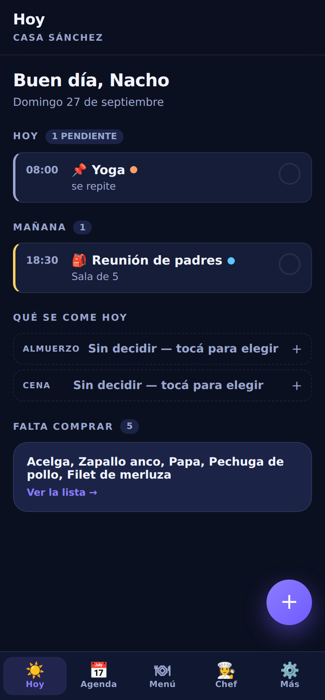
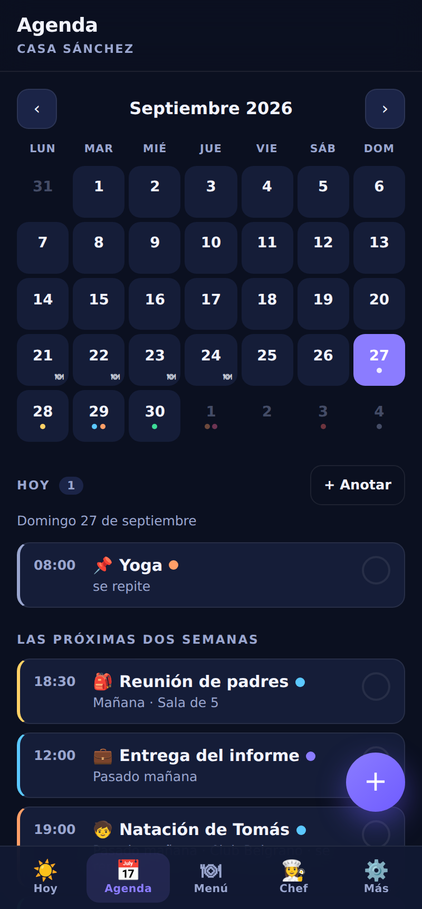
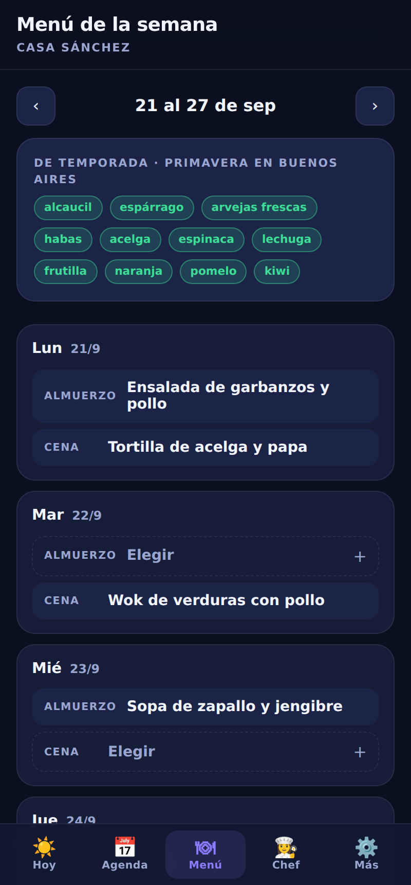
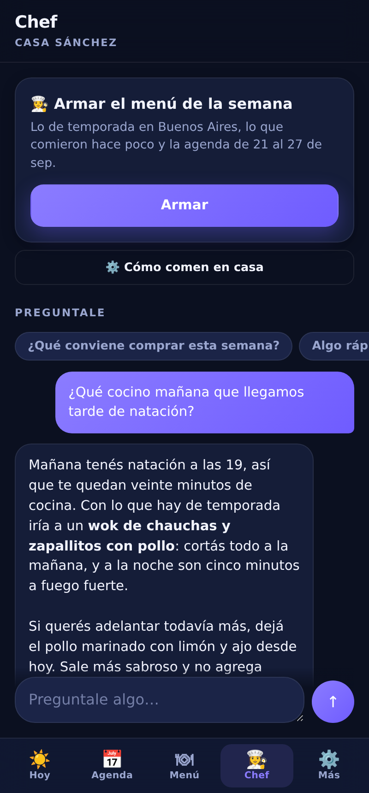
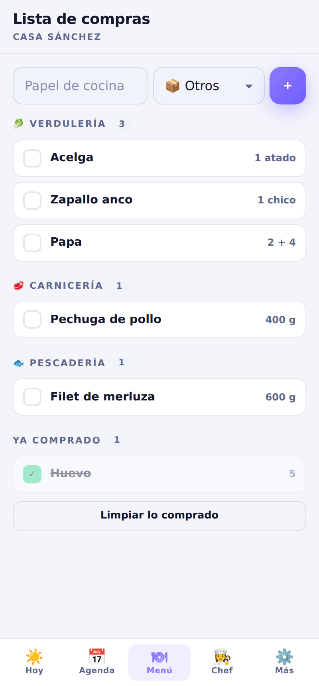
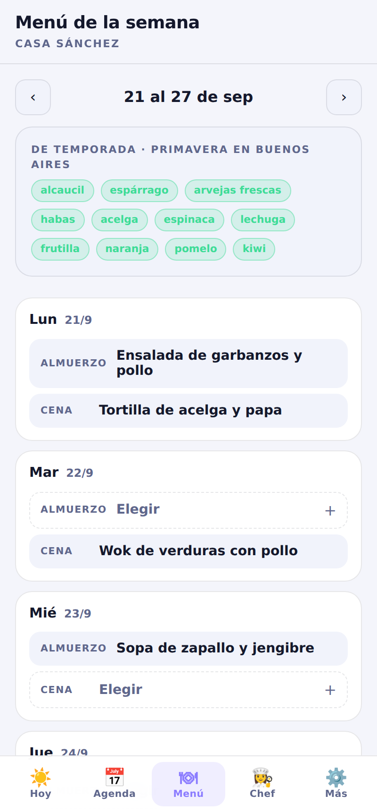
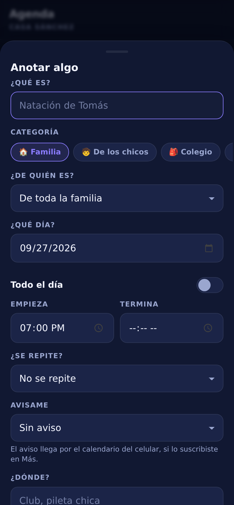

# Nuestra Agenda

La agenda de la familia y el menú de la semana, en un solo lugar.

Hecha para dos personas que comparten una casa y un hijo, y que se olvidan las
cosas. Corre en el celular como app (PWA), se sirve gratis desde GitHub Pages y
guarda todo en Supabase. No usa Vercel ni ningún otro servicio.

<p align="center">
  
  
  
  
</p>

---

## Qué hace

**Agenda compartida.** Los eventos se cargan una vez y los ven los dos, al
instante. Cada uno tiene su color; los chicos también, aunque no tengan cuenta.
Se pueden repetir (todos los días, semanal por días elegidos, cada 15, mensual,
anual) y una vez puntual se puede cancelar sin romper la serie.

**El celular avisa solo.** Esta es la parte que resuelve el "me olvido". La app
publica la agenda como un calendario `.ics` suscribible; se agrega una vez al
calendario del teléfono y desde ahí los recordatorios los da el sistema
operativo, mezclados con el resto de tus cosas. No hacen falta notificaciones
push, ni claves VAPID, ni un servidor escuchando.

**Menú semanal.** Un planificador de almuerzo y cena para los siete días, con un
recetario de comida de casa argentina. Cada comida guarda sus ingredientes.

**Lista de compras.** Sale de los ingredientes del menú con un toque, junta lo
repetido y queda agrupada por comercio: verdulería, carnicería, almacén.

**Un agente que sabe de temporada.** Propone el menú de la semana completo, o
contesta preguntas sueltas. Lo que lo hace distinto de preguntarle a un chatbot
cualquiera es el contexto que recibe:

- la lista real de lo que está de temporada **este mes en Buenos Aires**, así no
  propone tomate en julio;
- las restricciones y los gustos de la casa;
- lo que comieron las últimas dos semanas, para no repetir;
- **la agenda de esos días**. Si el martes hay natación a las 19, propone algo
  de veinte minutos, no un guiso de tres horas.

Lo que propone se revisa antes de cargarlo: se ve la lista, se saca lo que no
gusta, y recién ahí entra al planificador.

**Importar calendarios.** El del colegio, el del club, el de Google. Se pega el
link `.ics` o se sube el archivo. Resincronizar actualiza, no duplica.

### Sobre Cokidoo

Cokidoo no tiene API pública ni documentación para desarrolladores, así que no
hay forma de conectarse directo. Lo que sí funciona es el importador de
calendarios: si Cokidoo exporta un `.ics` o da un link de suscripción, entra por
ahí igual que el del colegio. Si en algún momento publican una API, el lugar
donde engancharla es `js/lib/ics.js` más una función nueva en
`supabase/functions/`.

---

## Cómo se instala

Está todo paso a paso en **[SETUP.md](SETUP.md)**. Son unos 15 minutos: crear el
proyecto de Supabase, pegar un SQL, cargar dos claves y prender GitHub Pages.

---

## Cómo está hecho

Sin framework y sin paso de build. Son archivos estáticos que el navegador
carga como módulos de ES. La razón es que el objetivo era que ustedes dos puedan
usarlo sin depender de nada más que las cuentas que ya tienen, y cada
herramienta de build agregada es una cosa más que se puede romper en dos años
cuando haya que tocar algo.

```
index.html                  la cáscara
config.js                   la URL y la clave de Supabase
css/app.css                 los estilos, tema claro y oscuro
js/
  main.js                   arranque y ruteo
  estado.js                 el estado compartido y el tiempo real
  lib/
    db.js                   todo lo que habla con Supabase
    fechas.js               fechas y repeticiones, en hora de Buenos Aires
    ics.js                  leer y escribir calendarios .ics
    ui.js                   armar nodos, avisos, hojas emergentes
  data/
    temporada.js            qué hay de temporada mes a mes en Buenos Aires
    recetas.js              el recetario base
    categorias.js           las categorías de evento
  views/                    una pantalla por archivo
supabase/
  schema.sql                tablas, RLS y funciones
  functions/
    chef-ia/                el agente
    ics-proxy/              bajar calendarios de afuera (CORS)
    ics-feed/               publicar la agenda como calendario
  tests/                    pruebas del esquema sobre un Postgres real
pruebas/                    pruebas de la interfaz en un navegador real
```

### Decisiones que vale la pena conocer

**Las horas viven en Buenos Aires, no en el dispositivo.** Para mostrar se
formatea con `Intl` fijando la zona; para guardar se escribe el offset `-03:00` a
mano. Si abrís la app de viaje ves "natación 19:00", que es lo que querés ver, y
no la hora que sería allá. Está todo en `js/lib/fechas.js`, con un comentario de
qué cambiar si Argentina volviera a usar horario de verano.

**La app y el calendario del celular tienen que coincidir siempre.** La app
expande las repeticiones por su cuenta para dibujar el calendario, y el feed
`.ics` las manda como `RRULE` para que las expande el teléfono. Si las dos
expansiones no dan lo mismo, ves una cosa en la app y otra en el celular, que es
el peor error posible en una agenda. Hay una prueba que compara las dos
expansiones usando ICAL.js como juez, sobre trece casos.

**El RRULE lleva el día y el mes escritos.** Sin eso, cada cliente de calendario
decide por su cuenta qué hacer con una fecha que no existe: para un cumpleaños
el 29 de febrero, unos lo saltean y otros lo corren al 1 de marzo.

**Una sola fuente para la estacionalidad.** La tabla está en
`js/data/temporada.js` y viaja como contexto en cada pedido al agente. La función
no tiene su propia copia, justamente para que no se desincronicen.

**Nada de la base se convierte en HTML.** Todo lo que escribió una persona entra
por `textContent`. Lo que devuelve el modelo se escapa primero y recién después
se le agrega el negrita. Hay dos pruebas que lo verifican.

---

## Las pruebas

Tres capas, todas corren sin servicios de afuera: ni Supabase, ni claves de API,
ni red. También corren solas en cada push (`.github/workflows/pruebas.yml`).

```bash
# 50 asserts: el esquema y las políticas RLS, contra un Postgres de verdad
./supabase/tests/run.sh

# 179 pruebas: las funciones y las librerías del frontend
deno task test

# 24 pruebas: la interfaz entera, en un Chromium de verdad
node pruebas/app.test.mjs
```

Lo que cubren:

- que un hogar no vea absolutamente nada del otro (RLS, sobre Postgres);
- que el `.ics` que se publica sea válido, verificado con ICAL.js en vez de
  comparando texto — un `.ics` mal armado no da error, simplemente el celular no
  muestra nada;
- que el parser entienda lo que escriben Google y Outlook de verdad, incluida la
  zona `Romance Standard Time`, que no es IANA;
- que el proxy de calendarios no se deje usar para leer direcciones internas
  (SSRF): 23 casos, desde `127.0.0.1` hasta `169.254.169.254`;
- que la app abra y se navegue entera sin un solo error de JavaScript;
- que lo que se escribe en un campo no se ejecute.

---

## Qué no hace

- **No manda notificaciones push.** A propósito: el feed `.ics` hace el trabajo
  mejor y sin servidor propio. Lo que sí se pierde es el aviso instantáneo
  cuando el otro carga algo: los calendarios suscritos se actualizan cada varias
  horas. Para algo de hoy mismo está el botón "agregar al calendario" del evento.
- **No sincroniza calendarios importados sola.** Hay que tocar el botón de
  resincronizar. Se podría automatizar con `pg_cron` en Supabase.
- **No hay app nativa.** Es una PWA: se instala desde el navegador con "Agregar a
  la pantalla de inicio".

---

<p align="center">
  
  
  
</p>
